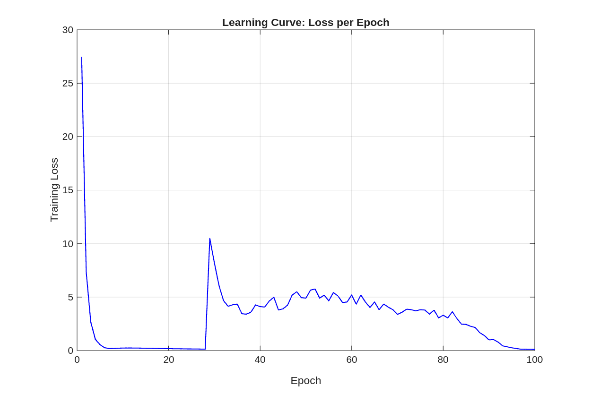
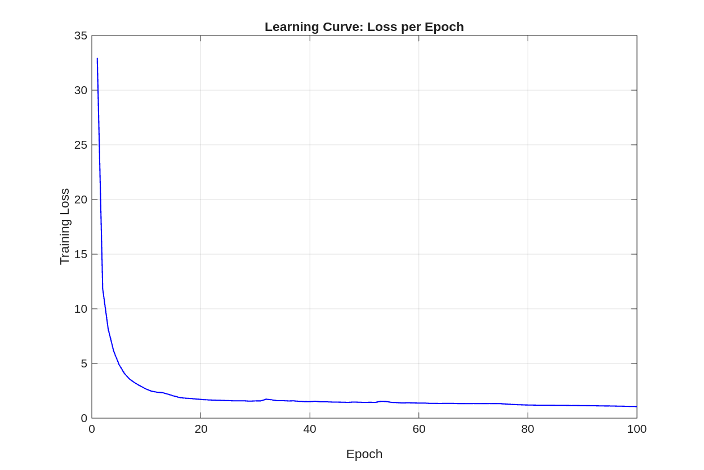

# An Exploration of the Forward-Forward Algorithm vs. Backpropagation

This project presents a comparative study of Geoffrey Hinton's Forward-Forward (FF) algorithm against a custom, from-scratch implementation of the traditional Backpropagation (BP) algorithm. The primary goal is to benchmark the two learning paradigms on the MNIST dataset, focusing on performance and computational efficiency.

The reference implementation for the Forward-Forward algorithm is taken directly from [Geoffrey Hinton's official MATLAB code](https://www.cs.toronto.edu/~hinton/). The Backpropagation model was carefully designed as a "dual" to the FF model, sharing the same network architecture and key hyperparameters to ensure a fair and rigorous comparison.

This project was originally developed as part of my Bachelor's thesis *"Forward-Forward Algorithm for Neural Network Training: Study and Example Application"*. While the code was originally private, it has now been made publicly available on GitHub, with major revisions to improve clarity and reproducibility.

## Project structure

The repository is organized as follows:

```
.
├── data/                       # Contains the MNIST dataset (.mat file)
├── results/                    # Output: models, plots, benchmarks
│   ├── benchmarks.md
│   ├── models/
│   └── plots/
├── src/                        # Source code
│   ├── backpropagation/        # Custom BP implementation
│   ├── hinton_forward_forward/ # Original FF code (unmodified)
│   └── utils/                  # Shared utilities (e.g., softmax)
├── .gitignore
├── LICENSE
├── README.md                   # This file
└── run_comparison.m            # Main script to execute all experiments
```

## Requirements

- The project was developed using MATLAB R2025a on Ubuntu 22.04.
- No additional toolboxes are required.

## How to run the experiments

### 1. Clone the repository:

```
git clone https://github.com/alessiopittiglio/forward-forward-matlab.git
cd forward-forward-matlab
```

### 2. Add the MNIST dataset

The `mnistdata.mat` file should be located in the `data/` directory.

### 3. Run the main script

Open MATLAB, navigate to the project's root directory, and run:

```
>> run_comparison
```

The script will:
- Train the Forward-Forward model using Hinton's reference code.
- Train the custom Backpropagation model.
- Evaluate both models on the MNIST test set.
- Generate and save all results (a summary table, learning curve plots, and the trained BP model) into the `results/` directory.

## Discussion

### Performance benchmark

The final performance of the two models, trained on the same 3-layer network architecture (1000-1000-1000 hidden units) for 100 epochs, is summarized below. Note that hyperparameters like the learning rate were tuned independently for each algorithm to achieve optimal performance.

| Metric                  | Forward-Forward (Hinton) | Backpropagation (Optimized) |
| ----------------------- | ------------------------ | --------------------------- |
| Training time (seconds) | ~663                     | ~347                        |
| Test set accuracy       | ~98.35%                  | ~98.34%                     |

As expected from theoretical FLOPs analysis, Backpropagation is computationally more efficient, completing its training in significantly less time. Both algorithms, when properly tuned, achieve highly competitive and comparable accuracy on the MNIST task.

### Training dynamics

A key finding relates to the training dynamics, particularly the role of the layer-wise normalization (`ffnormrows`) used in Hinton's architecture.

- The FF algorithm appears stable with a small learning rate (e.g., 0.01).
- The BP algorithm, when using the same normalization, shows significant numerical instability with small learning rates. It requires a much larger learning rate (e.g., 0.25) to learn effectively. However, this can lead to unstable training dynamics.

Below is a plot of the BP model's learning curve with normalization:



Ablation studies, in which normalization was removed from the BP model, confirm that this component was the driver of the observed instability. The plot below shows the learning curve of the BP model trained without normalization and with a learning rate of 0.15, compared to the 0.25 learning rate required when normalization was used.



This suggests that the two learning algorithms have different requirements for signal propagation and scaling.
